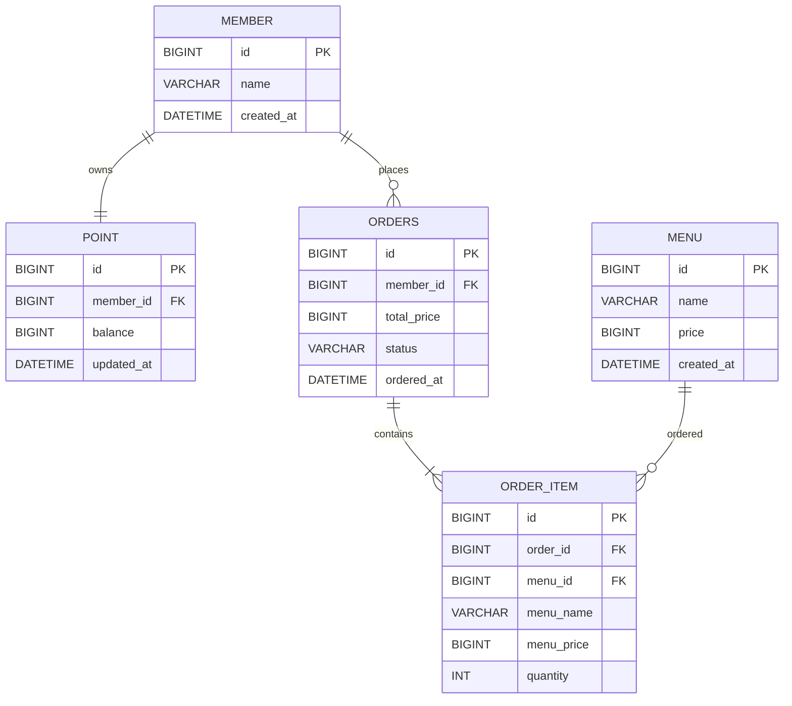

# Coffee Order Service

## 1. 프로젝트 소개

포인트로 커피를 주문하고, 최근 7일간 주문 내역으로 인기 메뉴를 조회하는 API 서버입니다.

필수 요구사항을 구현 범위로 정하며, 아래 API 명세와 전략은 구현할 설계입니다.

- 커피 메뉴 목록 조회
- 사용자 포인트 충전 (1원 = 1P)
- 커피 주문 및 포인트 결제
- 주문 정보를 데이터 수집 플랫폼으로 실시간 전송 (Mock 사용)
- 최근 7일간 인기 메뉴 3개 조회

사용자와 메뉴는 초기 데이터로 준비하고, 사용자 포인트는 0으로 시작합니다. 회원가입과 메뉴 등록 API는 구현 범위에 포함하지 않습니다.

## 2. 실행 방법

Java 17과 Docker Desktop이 필요합니다. Spring Boot, Spring Data JPA, MySQL 8.4, Gradle을 사용합니다.

```bash
# MySQL 실행
docker compose up -d

# 애플리케이션 실행
./gradlew bootRun
```

기본 주소: `http://localhost:8080`

앱이 시작되어 테이블이 생성되면 별도 터미널에서 초기 데이터를 입력합니다.

```bash
docker compose exec -T mysql mysql --default-character-set=utf8mb4 -ucoffee -pcoffee1234 coffee_order < docs/sql/seed.sql
```

사용자 ID `1`(테스트 사용자), 잔액 `0P`, 메뉴 ID `1`~`3`(아메리카노 4,500원·카페라테 5,000원·바닐라라테 5,500원)을 준비합니다. 재실행해도 기존 데이터와 충전한 잔액은 변경하지 않습니다.

## 3. ERD



## 4. API 명세

POST 요청의 본문은 `application/json` 형식입니다. 한 주문에는 한 종류의 메뉴를 담으며, `quantity`로 주문 수량을 지정합니다.

### 4.1 커피 메뉴 목록 조회

```http
GET /api/menus
```

#### 성공 응답

```json
{
  "menus": [
    {
      "menuId": 1,
      "name": "아메리카노",
      "price": 4500
    },
    {
      "menuId": 2,
      "name": "카페라테",
      "price": 5000
    }
  ]
}
```

응답 상태: `200 OK`

---

### 4.2 포인트 충전

```http
POST /api/members/{memberId}/points/charge
Content-Type: application/json
```

#### 요청

```json
{
  "amount": 10000
}
```

#### 성공 응답

```json
{
  "memberId": 1,
  "chargedAmount": 10000,
  "balance": 15000
}
```

응답 상태: `200 OK`

---

### 4.3 커피 주문 및 결제

```http
POST /api/orders
Content-Type: application/json
```

#### 요청

```json
{
  "memberId": 1,
  "menuId": 2,
  "quantity": 1
}
```

#### 성공 응답

```json
{
  "orderId": 1,
  "memberId": 1,
  "menuId": 2,
  "menuName": "카페라테",
  "quantity": 1,
  "totalPrice": 5000,
  "remainingPoint": 10000,
  "status": "COMPLETED",
  "orderedAt": "2026-10-02T13:00:00"
}
```

응답 상태: `201 Created`

---

### 4.4 인기 메뉴 목록 조회

```http
GET /api/menus/popular
```

#### 성공 응답

```json
{
  "menus": [
    {
      "menuId": 1,
      "menuName": "아메리카노",
      "orderCount": 15
    },
    {
      "menuId": 2,
      "menuName": "카페라테",
      "orderCount": 10
    },
    {
      "menuId": 3,
      "menuName": "바닐라라테",
      "orderCount": 7
    }
  ]
}
```

응답 상태: `200 OK`

조회 시각 기준 최근 7일 동안 완료된 주문의 메뉴별 주문 횟수를 집계합니다. 수량이 여러 잔이어도 같은 주문의 같은 메뉴는 1회로 계산합니다.

주문 횟수 내림차순, 동률이면 메뉴 ID 오름차순으로 최대 3개를 반환합니다. 주문된 메뉴가 3개 미만이면 있는 만큼 반환합니다.

---

### 4.5 에러 응답

공통 에러 응답:

```json
{
  "code": "INSUFFICIENT_POINT",
  "message": "보유 포인트가 부족합니다."
}
```

에러 코드:

| HTTP 상태 | 에러 코드 | 발생 상황 |
|---:|---|---|
| 400 | INVALID_CHARGE_AMOUNT | 서비스의 충전 금액 검증 실패 또는 잔액의 정수 범위 초과 |
| 400 | INVALID_REQUEST | 필수값 누락·입력 제약 위반·JSON 또는 사용자 식별값 형식 오류 |
| 400 | INVALID_ORDER_QUANTITY | 서비스의 주문 수량 검증 실패 |
| 400 | INVALID_ORDER_AMOUNT | 가격과 수량의 곱이 정수 범위를 초과 |
| 400 | INSUFFICIENT_POINT | 보유 포인트 부족 |
| 404 | MEMBER_NOT_FOUND | 사용자를 찾을 수 없음 |
| 404 | POINT_NOT_FOUND | 사용자의 포인트 계정을 찾을 수 없음 |
| 404 | MENU_NOT_FOUND | 메뉴를 찾을 수 없음 |

## 5. 설계 의도와 문제 해결 전략

### 데이터 구조

- `Member`와 `Point`를 분리해 사용자 정보와 잔액 변경 책임을 구분합니다. `member_id`에 유일 제약을 두어 사용자별 포인트 계정을 하나로 제한합니다.
- `Orders`는 주문자·결제 금액·상태를, `OrderItem`은 메뉴·수량을 관리합니다. 주문 당시 메뉴 이름과 가격을 저장해 메뉴 변경 후에도 기존 주문 내역을 보존합니다.
- 인기 메뉴는 주문 내역의 집계 결과이므로 별도 엔티티 없이 조회합니다. 별도 집계 테이블을 유지할 때 생기는 동기화 부담을 줄입니다.

### 포인트 충전과 주문·결제

충전 금액과 주문 수량은 양수여야 합니다. 포인트는 `Point`의 메서드로 충전·차감하고, 잔액이 부족하면 주문을 거절합니다. 결제 금액은 서버가 메뉴 가격과 수량으로 계산합니다.

사용자와 포인트 계정은 초기 데이터로 함께 준비하며, 충전 요청에서 자동 생성하지 않습니다. 사용자 또는 포인트 계정이 없으면 `404`를 반환합니다. 요청 DTO의 입력 검증 실패는 `INVALID_REQUEST`로 통일하고, 서비스의 충전 규칙 위반은 `INVALID_CHARGE_AMOUNT`로 구분합니다. 잔액 덧셈은 `Math.addExact`로 정수 범위 초과를 검사합니다.

포인트 차감과 주문·항목 저장은 서비스의 하나의 DB 트랜잭션에서 처리합니다. 중간에 실패하면 모두 롤백되어 포인트만 차감되는 것을 방지합니다. 이 트랜잭션만으로 동시 요청의 잔액 변경 충돌을 해결하지는 않으며, 다중 인스턴스 동시성 제어는 이번 범위에 포함하지 않습니다.

### 주문 데이터 전송

전송 책임을 `OrderDataSender` 인터페이스로 분리하고 Mock 구현체를 사용합니다. 주문 트랜잭션 커밋 후 즉시 사용자 식별값·메뉴 ID·결제 금액을 전달하고, 테스트에서 전달값을 확인합니다.

커밋 전에 전송하면 이후 롤백된 주문이 외부에 전달될 수 있어 커밋 후 전송을 선택합니다. 전송 실패 시 완료된 결제는 유지하며, 재시도와 전송 보장은 이번 범위에 포함하지 않습니다.

### 인기 메뉴 집계

조회 시각을 한 번 계산해 `[조회 시각 - 7일, 조회 시각)`에 완료된 주문을 대상으로 메뉴별 주문 횟수를 DB에서 집계합니다. `SUM(quantity)`는 판매 수량이므로, 주문 횟수 요구사항에 맞춰 메뉴별 `COUNT(DISTINCT order_id)`를 사용합니다. 주문 횟수와 메뉴 ID로 정렬하고 최대 3개를 조회합니다.

### 기술 선택 이유

| 선택 | 이유 |
|---|---|
| Spring Data JPA | 엔티티 관계와 기본 조회·저장을 관리하고, 인기 메뉴는 집계 쿼리로 처리 |
| DTO와 Bean Validation | API 형식을 엔티티와 분리하고 필수값·양수 입력 검증 |
| `@Transactional` | 포인트 차감과 주문 저장을 하나의 작업으로 처리 |
| `Long` | 정수 단위 금액과 포인트를 부동소수점 오차 없이 계산 |
| Docker Compose | 동일한 MySQL 개발 환경 구성 |
